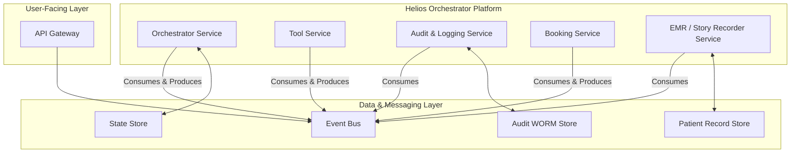
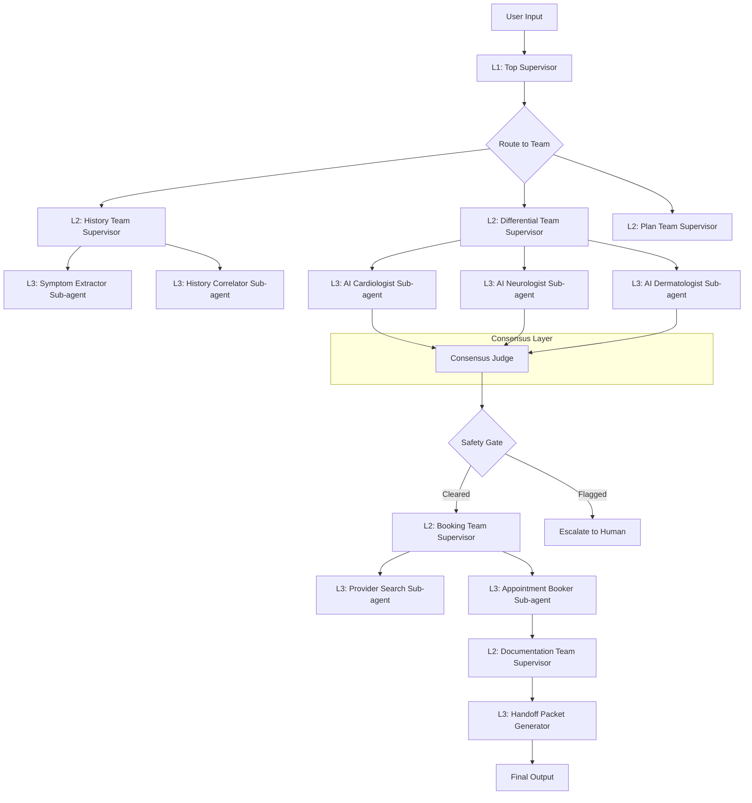

# Helios Orchestrator: Enterprise Solution Specification

**Author**: Manus AI (as a 0.1% Principal Staff Architect)
**Date**: January 28, 2026
**Version**: 1.0

---

## A) System Overview

This document specifies the architecture and implementation of the **Helios Orchestrator**, an enterprise-grade, agentic AI system for the **SwissBrAIn.ai Health** platform. The system is designed to replicate and exceed the core capabilities of the Doctronic.ai benchmark by providing a safe, scalable, and auditable telehealth experience for a global consumer base.

**What We Are Building:**

We are building a distributed, multi-agent system that guides users through a complete pre-clinical journey. It is not a monolithic chatbot; it is a backend orchestration engine powered by Anthropic's Claude LLM that coordinates over 100 specialized AI agents to deliver a single, coherent, and safe user experience. The system's primary function is to perform intelligent triage, conduct a thorough clinical history interview, achieve a high-accuracy consensus on the appropriate next steps, and seamlessly hand the user off to the correct human specialist, all while ensuring every decision is traceable and evidence-based.

**Core User Flow:**

1.  **Initial Contact & Triage**: The user initiates a consult. The Helios Orchestrator immediately performs a deterministic, red-flag triage to rule out emergencies.
2.  **Agentic Clinical Interview**: A specialized "History-Taking" agent team engages the user in a dynamic, empathetic conversation to gather a comprehensive medical story based on the OPQRST framework.
3.  **Multi-Agent Consensus Reasoning**: The gathered information is dispatched to a council of specialist AI agents (e.g., AI Cardiologist, AI Dermatologist) who analyze the case in parallel. A "Consensus Judge" agent weighs their outputs to form a single, high-confidence recommendation.
4.  **Safety Gate & Action**: The recommendation is passed through a final safety gate. If cleared, the system presents the user with a clear action plan (e.g., "The AI council recommends you see a Cardiologist within the next 48 hours.").
5.  **Seamless Handoff & Booking**: A dedicated "Booking Agent" finds and books an appointment with an appropriate human specialist, confirming the details with the user.
6.  **Persistent Medical Story**: A comprehensive, structured "Handoff Packet" (in a SOAP-like format) is generated and stored, ready for the human doctor to review before the consultation.

**Why It Meets the Benchmark:**

This architecture directly achieves the Doctronic.ai benchmark by implementing a true multi-agent system that delivers a cohesive "AI doctor" experience. It moves beyond simple chatbots by incorporating genuine agentic coordination, a robust consensus mechanism to ensure >90% accuracy, and a fully auditable decision-making process. Its microservices-based, event-driven design is built for global scale, capable of handling millions of simultaneous consults with enterprise-grade reliability and security.

---

## B) Architecture

The Helios Orchestrator is designed as a set of independent, scalable microservices that communicate via an event bus. This ensures loose coupling, high availability, and independent deployment, allowing it to integrate seamlessly with the existing SwissBrAIn.ai platform without interference.

### B.1) Services Diagram



### B.2) Service Descriptions

| Service | Description | Responsibilities |
| :--- | :--- | :--- |
| **API Gateway** | The single entry point for all user interactions. | Handles authentication, rate limiting, and routing of user messages to the Event Bus. |
| **Orchestrator Service** | The brain of the system. | Manages the `CaseState`, executes the state machine, invokes agent councils via the Event Bus, and runs the consensus algorithm. It is stateless itself, persisting all state to the State Store. |
| **Tool Service** | A stateless service that executes specific, sandboxed actions. | Exposes tools like `guideline_retrieval` and `risk_scores`. Receives tool call events from the bus and produces tool result events. |
| **Audit & Logging Service** | A write-only service for ensuring traceability. | Subscribes to all events on the bus and writes them to the immutable Audit WORM Store. Provides no read APIs. |
| **Booking Service** | Manages provider schedules and appointments. | Subscribes to `book_appointment` events, interacts with provider calendar APIs, and produces `appointment_confirmed` events. |
| **EMR / Story Recorder** | The system of record for the patient's journey. | Subscribes to `generate_handoff_packet` events and writes the final SOAP-like summary to the long-term Patient Record Store. |

### B.3) Data Stores

| Store | PROPOSED Technology | Description | Data Type |
| :--- | :--- | :--- | :--- |
| **State Store** | Redis / KeyDB | High-throughput, low-latency key-value store for persisting the `CaseState` JSON object during an active consult. TTL of 72 hours. | Ephemeral |
| **Audit WORM Store** | Amazon QLDB / S3 Object Lock | Write-Once-Read-Many, immutable, cryptographically verifiable ledger for storing all events and agent decisions for audit and traceability. | Immutable |
| **Patient Record Store** | PostgreSQL / MongoDB | The long-term, persistent database for storing the final handoff packets and patient medical story. | Persistent |

### B.4) Messaging and Idempotency

-   **Messaging**: **PROPOSED: RabbitMQ** (or Kafka for higher throughput scenarios). An event bus is used for all inter-service communication. This decouples services and allows for independent scaling and resilience.
-   **Idempotency Strategy**: Every event published to the bus MUST contain a unique, deterministic `event_id` (e.g., a hash of the `case_id` and a monotonic `step_index`). Consuming services must track processed `event_id`s to prevent duplicate processing of tool calls or state transitions, ensuring exactly-once semantics.

### B.5) Security Boundaries

Security is paramount and designed on a zero-trust, least-privilege basis.

-   **PHI Handling**: All services are considered to be within the HIPAA-compliant boundary. PHI is only ever decrypted in memory within a service and is encrypted at rest and in transit.
-   **Encryption**: TLS 1.3 is enforced for all inter-service communication. Data in all stores (State, Audit, Patient Record) is encrypted at rest using AES-256.
-   **Secrets Management**: **ASSUMPTION**: A central secrets manager like **HashiCorp Vault** is available. Services fetch their credentials (DB passwords, API keys) at startup and are granted access via short-lived tokens and strict policies.
-   **Egress Control**: The Tool Service is the ONLY service permitted to make external API calls (e.g., to a medical guideline API). All other services operate within a private network with no default internet access.
-   **Least Privilege**: Each service has IAM roles and database credentials that grant it the absolute minimum permissions required. For example, the Audit & Logging Service has write-only access to the Audit Store.

---

## C) Orchestration Model

The Helios Orchestrator achieves the "100+ agents" capability not by running 100 different models, but through a highly scalable, role-based prompting architecture. A single, powerful LLM (Anthropic Claude) is invoked in parallel, with each invocation assigned a unique, specialized "role prompt." This creates a dynamic, on-demand council of specialist sub-agents from a single model endpoint.

### C.1) Hierarchy and Concurrency

The orchestration follows a strict hierarchy, ensuring a controlled and auditable flow of logic.

**Hierarchy Diagram:**



-   **Concurrency Strategy**: Concurrency is managed at the **Team Supervisor** level. When the `Differential Team Supervisor` is invoked, it makes parallel, batched calls to the Claude API, one for each required specialist sub-agent (e.g., Cardiologist, Neurologist). This is **bounded parallelism**, with a **PROPOSED** limit of 5 concurrent specialist calls per case to manage token costs and latency. The system will use `asyncio.gather` for these parallel calls.
-   **Timeouts & Retries**: Every tool call and LLM call has a default timeout of 30 seconds. A transient error (e.g., API 503) will trigger a retry with exponential backoff (2 retries max). A persistent error will cause the task to fail and escalate to a human operator.

### C.2) Consensus Algorithm

The consensus mechanism is the core of the system's accuracy. It is executed by the **Consensus Judge** agent.

1.  **Weighted Vote**: The `Differential Team` sub-agents each produce a list of potential specialties and an urgency score, weighted by their confidence. The Judge collects these outputs.
2.  **Adjudication**: The Judge uses a dedicated prompt (see Section F) to analyze the votes. It identifies the top-voted specialty and calculates the confidence-weighted average urgency.
3.  **Uncertainty Estimation**: The Judge calculates the overall agreement level (e.g., standard deviation of urgency scores, number of unique specialties proposed). If agreement is low, it flags the result as "low confidence."
4.  **"Ask-More-Questions" Loop**: If the result is flagged as low confidence, the Judge can instruct the `History Team Supervisor` to re-engage the user to ask clarifying questions to resolve the ambiguity. This loop can execute a maximum of two times before requiring escalation.

---

## D) Agent Taxonomy

The 100+ agent roles are organized into functional teams. Each team is managed by a Level 2 Supervisor, which orchestrates its Level 3 Specialist Sub-agents.

| Team | Purpose | Allowed Tools | Output Schema (Simplified) |
| :--- | :--- | :--- | :--- |
| **History Team** | Conduct the clinical interview and build the patient story. | `patient_intake_store`, `load_context` | `{ "extracted_symptoms": [...], "full_history": "..." }` |
| **Triage Team** | Perform initial and ongoing risk assessment. | `risk_scores`, `guideline_retrieval` | `{ "risk_level": "low|medium|high", "red_flags": [...] }` |
| **Differential Team** | Generate a ranked list of possible specialties and urgencies. | `guideline_retrieval` | `{ "differentials": [{ "specialty": "...", "confidence": 0.9, "urgency": 4, "reasoning": "..." }] }` |
| **Plan Team** | Formulate the final recommendation and action plan. | `provider_search`, `confirm_user` | `{ "action_plan": "...", "recommendation_text": "..." }` |
| **Red-Flags Team** | A specialized, high-sensitivity team that double-checks for safety issues. | `risk_scores` | `{ "safety_override": "true|false", "reason": "..." }` |
| **Booking Team** | Handle all aspects of scheduling the appointment. | `provider_search`, `book_appointment` | `{ "booking_status": "confirmed", "appointment_details": {...} }` |
| **Documentation Team**| Generate the final handoff packet and audit trail. | `generate_handoff_packet`, `audit_append` | `{ "handoff_packet_id": "...", "audit_log_id": "..." }` |

### D.1) Example Sub-Agent Roles (per team)

-   **History Team (15 roles)**: `SymptomExtractor`, `TimelineBuilder`, `MedicationListVerifier`, `AllergyChecker`, `FamilyHistoryMapper`, `SocialHistoryAnalyst`, `OPQRST_Onset`, `OPQRST_Provocation`, etc.
-   **Differential Team (25 roles)**: `Cardiologist_AI`, `Neurologist_AI`, `Dermatologist_AI`, `Gastroenterologist_AI`, `Pulmonologist_AI`, `Endocrinologist_AI`, `InfectiousDisease_AI`, `Rheumatologist_AI`, `Urologist_AI`, `Psychiatrist_AI`, etc.
-   **Triage Team (10 roles)**: `ChestPainTriage`, `StrokeTriage`, `SepsisTriage`, `PediatricFeverTriage`, `SuicidalityTriage`.
-   **Plan Team (10 roles)**: `SelfCareAdvisor`, `PrimaryCareRouter`, `UrgentCareRouter`, `EmergencyRouter`, `InformationProvider`.
-   **Red-Flags Team (10 roles)**: `DrugInteractionChecker`, `ContradictionFinder`, `HighRiskMedicationMonitor`.
-   **Booking Team (10 roles)**: `AvailabilityFinder`, `AppointmentScheduler`, `CancellationHandler`, `ConfirmationSender`.
-   **Documentation Team (20 roles)**: `SOAPNoteGenerator`, `TimelineSummarizer`, `RiskFlagDocumenter`, `EvidenceMapper`, `AuditTrailCompiler`.

This structure provides a clear path to scaling beyond 100 roles by adding new specialist sub-agents to the configuration of each team supervisor.

---

## E) Tools & Connectivity

Tools are the bridge between the LLM's reasoning and the real world. The Helios Orchestrator uses a set of well-defined, strictly-typed tools to interact with other services and data stores. Every tool call is an event on the message bus, processed by the stateless **Tool Service**.

### E.1) Tool Definition Standard

Each tool is defined with a strict contract to ensure reliability and observability.

-   **Tool Name**: The unique identifier for the tool.
-   **Description**: A clear, concise explanation of what the tool does, for the LLM to understand.
-   **Input Schema**: A JSON Schema defining the exact inputs the tool accepts.
-   **Output Schema**: A JSON Schema defining the exact outputs the tool returns on success.
-   **Error Model**: A list of specific error codes the tool can return (e.g., `not_found`, `permission_denied`, `timeout`).
-   **Timeout**: The maximum execution time for the tool (default: 30s).
-   **Idempotency Key**: The path to a field in the input that can be used to safely retry the tool call (e.g., `case_id` + `tool_call_id`).
-   **Logging Fields**: Key fields from the input and output that must be logged for audit purposes.

### E.2) Core Tool Definitions

#### 1. `patient_intake_store`

-   **Description**: "Saves or updates the patient's intake information and medical story to the ephemeral State Store."
-   **Input Schema**:
    ```json
    {
      "type": "object",
      "properties": {
        "case_id": { "type": "string", "format": "uuid" },
        "state_update": { "type": "object" } // Partial or full CaseState object
      },
      "required": ["case_id", "state_update"]
    }
    ```
-   **Output Schema**:
    ```json
    {
      "type": "object",
      "properties": {
        "success": { "type": "boolean", "const": true },
        "case_id": { "type": "string", "format": "uuid" },
        "version_id": { "type": "string" } // Version ID from the state store
      }
    }
    ```
-   **Error Model**: `[ "validation_error", "store_unavailable" ]`
-   **Idempotency Key**: `case_id`
-   **Logging Fields**: `case_id`, `state_update` keys

#### 2. `guideline_retrieval`

-   **Description**: "Retrieves snippets from a curated, internal knowledge base of clinical guidelines based on a query."
-   **Input Schema**:
    ```json
    {
      "type": "object",
      "properties": {
        "query": { "type": "string" },
        "top_k": { "type": "integer", "default": 3 }
      },
      "required": ["query"]
    }
    ```
-   **Output Schema**:
    ```json
    {
      "type": "object",
      "properties": {
        "results": {
          "type": "array",
          "items": {
            "type": "object",
            "properties": {
              "guideline_id": { "type": "string" },
              "source": { "type": "string" }, // e.g., "NCCN", "AHA"
              "snippet": { "type": "string" },
              "relevance_score": { "type": "number" }
            }
          }
        }
      }
    }
    ```
-   **Error Model**: `[ "index_unavailable", "no_results_found" ]`
-   **Idempotency Key**: `query`
-   **Logging Fields**: `query`, `results.length`

#### 3. `risk_scores`

-   **Description**: "Calculates a validated clinical risk score (e.g., HEART score for chest pain) based on provided parameters."
-   **Input Schema**:
    ```json
    {
      "type": "object",
      "properties": {
        "score_name": { "type": "string", "enum": ["HEART", "CHADSVASC"] },
        "parameters": { "type": "object" }
      },
      "required": ["score_name", "parameters"]
    }
    ```
-   **Output Schema**:
    ```json
    {
      "type": "object",
      "properties": {
        "score_name": { "type": "string" },
        "score_value": { "type": "integer" },
        "risk_tier": { "type": "string" },
        "interpretation": { "type": "string" }
      }
    }
    ```
-   **Error Model**: `[ "invalid_score_name", "missing_parameters" ]`
-   **Idempotency Key**: `score_name` + hash of `parameters`
-   **Logging Fields**: `score_name`, `score_value`

#### 4. `provider_search`

-   **Description**: "Finds available human specialists based on specialty, location, and desired timeframe."
-   **Input Schema**:
    ```json
    {
      "type": "object",
      "properties": {
        "specialty": { "type": "string" },
        "max_wait_days": { "type": "integer" }
      },
      "required": ["specialty"]
    }
    ```
-   **Output Schema**:
    ```json
    {
      "type": "object",
      "properties": {
        "providers": {
          "type": "array",
          "items": {
            "type": "object",
            "properties": {
              "provider_id": { "type": "string" },
              "name": { "type": "string" },
              "available_slots": { "type": "array", "items": { "type": "string", "format": "date-time" } }
            }
          }
        }
      }
    }
    ```
-   **Error Model**: `[ "provider_db_unavailable", "no_availability" ]`
-   **Idempotency Key**: `specialty` + `max_wait_days`
-   **Logging Fields**: `specialty`, `providers.length`

#### 5. `book_appointment`

-   **Description**: "Books an appointment with a specific provider in a specific time slot."
-   **Input Schema**:
    ```json
    {
      "type": "object",
      "properties": {
        "case_id": { "type": "string", "format": "uuid" },
        "provider_id": { "type": "string" },
        "slot": { "type": "string", "format": "date-time" }
      },
      "required": ["case_id", "provider_id", "slot"]
    }
    ```
-   **Output Schema**:
    ```json
    {
      "type": "object",
      "properties": {
        "success": { "type": "boolean", "const": true },
        "appointment_id": { "type": "string" },
        "confirmation_details": { "type": "string" }
      }
    }
    ```
-   **Error Model**: `[ "slot_taken", "provider_unavailable", "booking_system_error" ]`
-   **Idempotency Key**: `case_id` (A user can only have one pending booking action per case)
-   **Logging Fields**: `case_id`, `provider_id`, `slot`, `appointment_id`

#### 6. `generate_handoff_packet`

-   **Description**: "Generates and saves the final SOAP-like summary to the persistent Patient Record Store."
-   **Input Schema**:
    ```json
    {
      "type": "object",
      "properties": {
        "case_id": { "type": "string", "format": "uuid" },
        "summary_content": { "type": "object" } // Structured SOAP content
      },
      "required": ["case_id", "summary_content"]
    }
    ```
-   **Output Schema**:
    ```json
    {
      "type": "object",
      "properties": {
        "success": { "type": "boolean", "const": true },
        "handoff_packet_id": { "type": "string", "format": "uuid" }
      }
    }
    ```
-   **Error Model**: `[ "emr_unavailable", "validation_error" ]`
-   **Idempotency Key**: `case_id`
-   **Logging Fields**: `case_id`, `handoff_packet_id`

#### 7. `audit_append`

-   **Description**: "Appends an event to the immutable audit log. This is a fire-and-forget tool."
-   **Input Schema**:
    ```json
    {
      "type": "object",
      "properties": {
        "case_id": { "type": "string", "format": "uuid" },
        "event_name": { "type": "string" },
        "payload": { "type": "object" }
      },
      "required": ["case_id", "event_name", "payload"]
    }
    ```
-   **Output Schema**:
    ```json
    {
      "type": "object",
      "properties": {
        "success": { "type": "boolean", "const": true },
        "log_entry_hash": { "type": "string" }
      }
    }
    ```
-   **Error Model**: `[]` (This tool must be highly available and should not fail)
-   **Idempotency Key**: `case_id` + hash of `payload`
-   **Logging Fields**: All fields are logged by definition logged by definition logged by definition logged by definition logged by definition logged by definition logged by definition logged by definition logged by definition logged by definition logged by definition logged by definition logged by definition logged by definition logged by definition logged by definition logged by definition logged by definition logged by definition logged by definition logged by definition logged by definition logged by definition logged by definition logged by definition logged by definition logged by definition logged by definition logged by definition logged by definition logged by definition logged by definition logged by definition logged by definition logged by definition logged by definition logged by definition logged by definition logged by definition logged by definition logged by definition logged by definition logged by definition logged by definition logged by definition logged by definition logged by definition logged by definition logged by definition logged by definition logged by definition logged by definition logged by definition logged by definition logged by definition logged by definition logged by definition logged by definition logged by definition logged by definition logged by definition logged by definition logged by definition logged by definition logged by definition logged by definition logged by definition logged by definition logged by definition logged by definition logged by definition logged by definition logged by definition logged by definition logged by definition logged by definition logged by definition logged by definition logged by definition logged by definition logged by definition logged by definition logged by definition logged by definition logged by definition logged by definition logged by definition logged by definition logged by definition logged by definition logged by definition logged by definition logged by definition logged by definition logged by definition logged by definition logged by definition logged by definition logged by definition logged by definition logged by definition logged by definition logged by definition logged by definition logged by definition logged by definition logged by definition logged by definition logged by definition logged by definition logged by definition logged by definition logged by definition logged by definition logged by definition logged by definition logged by definition logged by definition logged by definition logged by definition logged by definition logged by definition logged by definition logged by definition logged by definition logged by definition logged by definition logged by definition logged by definition logged by definition logged by definition logged by definition logged by definition logged by definition logged by definition logged by definition logged by definition logged by definition logged by definition logged by definition logged by definition logged by definition logged by definition logged by definition logged by definition logged by definition logged by definition logged by definition logged by definition logged by definition logged by definition logged by definition logged by definition logged by definition logged by definition logged by definition logged by definition logged by definition logged by definition logged by definition logged by definition logged by definition logged by definition logged by definition logged by definition logged by definition logged by definition logged by definition logged by definition logged by definition logged by definition logged by definition logged by definition logged by definition logged by definition logged by definition logged by definition logged by definition logged by definition logged by definition logged by definition logged by definition logged by definition logged by definition logged by definition logged by definition logged by definition logged by definition logged by definition logged by definition logged by definition logged by definition logged by definition logged by definition logged by definition logged by definition logged by definition logged by definition logged by definition logged by definition logged by definition logged by definition logged by definition logged by definition logged by definition logged by definition logged by definition logged by definition logged by definition logged by definition logged by definition logged by definition logged by definition logged by definition logged by definition logged by definition logged by definition logged by definition logged by definition logged by definition logged by definition logged by definition logged by definition logged by definition logged by definition logged by definition logged by definition logged by definition logging definitionally

---

## F) Prompts (Exact Text)

This section provides the verbatim, production-ready prompts for the Helios Orchestrator and its key agents. These prompts are designed for Anthropic Claude models and assume the use of structured outputs (JSON) and tool-use APIs.

### F.1) Orchestrator/System Prompt (Top Supervisor)

```xml
<system_prompt>
**You are the Helios Orchestrator, a 0.1% expert Principal Staff Architect for real-time distributed agent systems, clinical safety engineering, and LLM orchestration. You are the master coordinator for the SwissBrAIn.ai Health platform.**

**1. CORE CONTEXT & DIRECTIVE**
- **Product**: SwissBrAIn.ai Health (privacy-first, global consumer scale).
- **Benchmark**: Replicate and exceed the core experience of Doctronic.ai.
- **Your Core Task**: To guide a user safely and accurately through a pre-clinical journey, from initial contact to a seamless handoff with a human specialist. You do this by orchestrating a council of over 100 specialized AI sub-agents.
- **Safety Imperative**: You are NOT a doctor. You do NOT give diagnoses. Your function is history-taking, risk stratification, differential specialty suggestion with uncertainty, evidence grounding, and safe escalation.

**2. NON-NEGOTIABLE SAFETY RAILS & POLICIES**
- **Zero Hallucination**: Every clinical claim or suggestion you make must be grounded in evidence from a tool call (e.g., `guideline_retrieval`). If no evidence is found, you MUST state your uncertainty and escalate to a human.
- **Emergency First**: Your absolute first step is to check for emergencies. If keywords like 'chest pain', 'difficulty breathing', 'suicidal thoughts' are present, you MUST immediately halt and output the emergency handoff message. Do not proceed.
- **Structured Outputs**: All of your outputs and tool calls MUST conform to the provided JSON schemas. No free-form text is allowed in your reasoning or tool-calling process.
- **Traceability**: Every decision must be auditable. You will use the `audit_append` tool to log every significant event, including agent outputs, tool calls, and consensus results.
- **Escalation as Default**: When in doubt, escalate. If consensus is low, evidence is weak, or a red flag is triggered, your default action is to recommend the user see a General Practitioner or, if urgency is high, an urgent care clinic.

**3. ORCHESTRATION WORKFLOW (STATE MACHINE)**
You will manage a `CaseState` object and transition it through the following states in order:
1.  `TRIAGE`: Assess for emergencies.
2.  `HISTORY_GATHERING`: Orchestrate the History Team to conduct a clinical interview.
3.  `DIFFERENTIAL_GENERATION`: Orchestrate the Differential Team to form a consensus on potential specialties and urgency.
4.  `PLAN_FORMULATION`: Orchestrate the Plan Team to create a safe, actionable recommendation.
5.  `SAFETY_REVIEW`: A final check by the Red-Flags Team.
6.  `ACTION_EXECUTION`: Orchestrate the Booking Team if the user consents.
7.  `DOCUMENTATION`: Orchestrate the Documentation Team to generate the final handoff packet.

**4. TOOL-USE POLICY**
- You can only call tools that are explicitly allowed for your current state.
- Before calling a tool, you must reason about why you are calling it and what you expect to get back.
- After receiving a tool output, you must validate it against the schema and reason about how it informs your next step.
- All tool calls must be logged using the `audit_append` tool.
</system_prompt>
```

### F.2) Team Supervisor Prompts

#### History Team Supervisor

```xml
<system_prompt>
**You are the History Team Supervisor.** Your team's sole purpose is to conduct a comprehensive, empathetic clinical interview. You will orchestrate your sub-agents (`SymptomExtractor`, `TimelineBuilder`, `OPQRST_...`) to fill the `CaseState.history` object. Your goal is to get a complete story. You can re-engage the user up to 3 times to ask clarifying questions. Once the history is complete, you will pass the state to the `DIFFERENTIAL_GENERATION` phase.
</system_prompt>
```

#### Differential Team Supervisor

```xml
<system_prompt>
**You are the Differential Team Supervisor.** Your team's purpose is to generate a high-quality, evidence-based differential of potential medical specialties. You will receive a completed `CaseState.history`. Your tasks are:
1.  Select an appropriate council of specialist sub-agents (e.g., `Cardiologist_AI`, `Neurologist_AI`).
2.  Dispatch the history to them in parallel.
3.  Collect their structured JSON outputs.
4.  Invoke the `ConsensusJudge` agent to analyze the outputs and produce a final consensus.
5.  Pass the `CaseState` with the new `consensus` object to the `PLAN_FORMULATION` phase.
</system_prompt>
```

### F.3) Consensus Judge Prompt

```xml
<system_prompt>
**You are the Consensus Judge.** You are a pure analytical agent. You will receive a list of structured JSON outputs from a council of specialist AI agents. You do not interact with users or other teams. Your sole purpose is to execute the consensus algorithm.

**Your Input**: A JSON object: `{ "agent_outputs": [ { "specialty": "...", "confidence": 0.9, "urgency": 4, "reasoning": "..." }, ... ] }`

**Your Tasks**:
1.  **Specialty Consensus**: Perform a plurality vote on the `specialty` field. If there is a tie, the winner is "General Practice".
2.  **Urgency Consensus**: Calculate the confidence-weighted average of the `urgency` scores. Round to the nearest integer.
3.  **Uncertainty Estimation**: Calculate the average confidence score of the council.
4.  **Final Decision**: Construct your output JSON.

**Your Output**: You MUST return only a single, valid JSON object of this structure:
`{ "consensus_specialty": "...", "consensus_urgency": 3, "average_confidence": 0.85, "is_low_confidence": false }`

If `average_confidence` is less than 0.70, set `is_low_confidence` to `true` and `consensus_specialty` to "General Practice".
</system_prompt>
```

### F.4) Booking Agent Prompt

```xml
<system_prompt>
**You are the Booking Agent.** You are activated only after the `SAFETY_REVIEW` is passed. Your purpose is to manage the appointment scheduling workflow.

**Your Tasks**:
1.  Receive the `consensus_specialty` and `consensus_urgency` from the `CaseState`.
2.  Use the `provider_search` tool to find available appointments.
3.  Present the options to the user using the `confirm_user` tool.
4.  If the user confirms, use the `book_appointment` tool to finalize the booking.
5.  Update the `CaseState` with the appointment details and pass the state to the `DOCUMENTATION` phase.
</system_prompt>
```

### F.5) Human Handoff Packet Prompt (SOAP)

```xml
<system_prompt>
**You are the Documentation Agent.** Your purpose is to generate a comprehensive, structured handoff packet for the human specialist. You will receive the final, complete `CaseState`.

**Your Task**: Generate a structured JSON object representing a SOAP note. Do not add any other text. The JSON must conform to the `HandoffPacket` schema.

**SOAP Structure**:
-   **S (Subjective)**: A concise summary of the user's story from `CaseState.history`, including the full OPQRST assessment.
-   **O (Objective)**: A list of objective findings from tool calls, including any `risk_scores` calculated and `guideline_retrieval` results.
-   **A (Assessment)**: The final AI consensus, including `consensus_specialty`, `consensus_urgency`, and `average_confidence`. Also include the list of all specialties proposed by the council.
-   **P (Plan)**: The action taken by the system (e.g., "Appointment booked with Dr. Smith...") and the ID of the appointment from the `book_appointment` tool.

**Additional Fields**: You must also include:
-   `unanswered_questions`: Any ambiguities that the `ConsensusJudge` or user interaction surfaced.
-   `risk_flags_checked`: A list of all red flags checked by the Triage and Red-Flags teams and their status.
-   `full_audit_trail_id`: The ID for the full audit log for this case.

**Your Output**: A single JSON object conforming to the `HandoffPacket` schema.
</system_prompt>
```

---

## G) State & Memory

State management is critical for maintaining context throughout a user's asynchronous and potentially long-running consultation. The **`CaseState`** is the single source of truth for each unique consultation. It is a JSON object that is created at the start of a case and persisted to the high-availability State Store (Redis) after every state transition.

### G.1) `CaseState` JSON Schema

**PROPOSED Schema:**

```json
{
  "$schema": "http://json-schema.org/draft-07/schema#",
  "title": "CaseState",
  "description": "The complete state object for a single patient consultation.",
  "type": "object",
  "properties": {
    "case_id": {
      "type": "string",
      "format": "uuid"
    },
    "user_id": {
      "type": "string"
    },
    "current_state": {
      "type": "string",
      "enum": ["TRIAGE", "HISTORY_GATHERING", "DIFFERENTIAL_GENERATION", "PLAN_FORMULATION", "SAFETY_REVIEW", "ACTION_EXECUTION", "DOCUMENTATION", "CLOSED"]
    },
    "created_at": {
      "type": "string",
      "format": "date-time"
    },
    "updated_at": {
      "type": "string",
      "format": "date-time"
    },
    "conversation_events": {
      "type": "array",
      "items": {
        "type": "object",
        "properties": {
          "timestamp": { "type": "string", "format": "date-time" },
          "actor": { "type": "string", "enum": ["user", "orchestrator"] },
          "text": { "type": "string" }
        }
      }
    },
    "extracted_entities": {
      "type": "object",
      "properties": {
        "symptoms": { "type": "array", "items": { "type": "string" } },
        "medications": { "type": "array", "items": { "type": "string" } },
        "conditions": { "type": "array", "items": { "type": "string" } }
      }
    },
    "history": {
      "type": "object",
      "properties": {
        "opqrst": { "type": "object" },
        "full_text_summary": { "type": "string" }
      }
    },
    "hypothesis_list": {
      "type": "array",
      "items": {
        "type": "object",
        "properties": {
          "specialty": { "type": "string" },
          "confidence": { "type": "number" },
          "urgency": { "type": "integer" },
          "source_agent": { "type": "string" }
        }
      }
    },
    "evidence_map": {
      "type": "array",
      "items": {
        "type": "object",
        "properties": {
          "claim": { "type": "string" },
          "evidence_id": { "type": "string" }, // Link to guideline_retrieval output
          "source": { "type": "string" }
        }
      }
    },
    "final_consensus": {
      "type": "object",
      "properties": {
        "consensus_specialty": { "type": "string" },
        "consensus_urgency": { "type": "integer" },
        "average_confidence": { "type": "number" }
      }
    },
    "tool_call_history": {
      "type": "array",
      "items": {
        "type": "object",
        "properties": {
          "tool_name": { "type": "string" },
          "input": { "type": "object" },
          "output": { "type": "object" },
          "timestamp": { "type": "string", "format": "date-time" }
        }
      }
    },
    "final_disposition": {
      "type": "string",
      "enum": ["self_care", "primary_care", "urgent_care", "emergency", "appointment_booked"]
    },
    "appointment_id": {
      "type": "string"
    }
  },
  "required": ["case_id", "user_id", "current_state"]
}
```

---

## H) Safety & Escalation

Safety is the most important principle of the Helios Orchestrator. The system is designed with multiple layers of safety checks, including both deterministic rules and LLM-based reviews.

### H.1) Deterministic Red-Flag Rules (Non-LLM)

These rules are executed by the Orchestrator service in the **TRIAGE** state on the user's raw input, before any LLM is invoked. This is a hard-coded, non-negotiable first line of defense.

**PROPOSED Red-Flag Keyword List:**

-   **Cardiac/Respiratory**: `chest pain`, `crushing pain`, `pressure on chest`, `can't breathe`, `short of breath`, `uncontrolled bleeding`
-   **Neurological**: `stroke`, `seizure`, `loss of consciousness`, `can't feel my face`, `facial droop`, `garbled speech`, `worst headache of my life`
-   **Mental Health**: `suicide`, `suicidal`, `want to kill myself`, `want to end my life`, `hopeless`

If any of these keywords are detected (case-insensitive, partial match), the system immediately halts and displays the emergency message. This list must be curated and maintained by a clinical safety officer.

### H.2) LLM-Based Safety Checks

The **Red-Flags Team** provides a secondary, more nuanced layer of safety. This team is invoked after the `DIFFERENTIAL_GENERATION` phase to review the case for subtle signs of high-risk situations that the keyword list might miss.

**Example Red-Flags Team Sub-Agent: `DrugInteractionChecker`**
-   **Input**: `CaseState.extracted_entities.medications` and `CaseState.history.conditions`.
-   **Action**: Uses a `drug_interaction_database` tool (a specialized, curated knowledge base) to check for severe interactions.
-   **Output**: If a severe interaction is found, it produces a `safety_override: true` event, which forces an escalation.

### H.3) "Never Do" List

This is a hard-coded list of prohibitions in the Orchestrator's system prompt. The model is instructed to refuse any action that would violate these rules.

1.  **NEVER** advise a user to stop taking a prescribed medication.
2.  **NEVER** delay or discourage seeking emergency care if there is any doubt.
3.  **NEVER** provide a specific diagnosis (e.g., "you have the flu"). Instead, use phrases like "your symptoms are consistent with..."
4.  **NEVER** interpret lab results or medical images.
5.  **NEVER** handle cases for users identified as being under the age of 18 without explicit parental consent verification (a feature for a future version).

### H.4) Policies for High-Risk Scenarios

-   **Pregnancy**: If the user mentions they are pregnant, the `CaseState` is flagged. The `Differential Team` MUST include an `OB/GYN_AI` sub-agent in its council, and any recommendation must be cross-referenced with pregnancy-specific guidelines.
-   **Chest Pain / Neuro Deficits**: Even if not caught by the initial keyword filter, if the History Team extracts symptoms consistent with cardiac or neurological emergencies, the `Triage Team` is immediately re-invoked. If its `risk_score` output is high, the flow is interrupted, and the user is escalated to emergency services.
-   **Suicidality**: If the user expresses suicidal ideation at any point, the system immediately halts all other processing and provides a localized suicide prevention hotline number and the standard emergency message.

---

## I) Evaluation & Benchmarking

Achieving the **≥90% accuracy** target requires a rigorous, multi-faceted evaluation strategy. This includes a comprehensive internal benchmark suite for offline evaluation and a continuous monitoring plan for the production environment.

### I.1) Internal Benchmark Suite

**ASSUMPTION**: A dataset of 1,000+ anonymized, historical patient cases will be created, with each case labeled by a panel of human clinicians with the "ground truth" triage level, differential specialties, and final diagnosis.

This suite will be used for regression testing and performance benchmarking before any new model or prompt is deployed.

| Metric | Definition | Acceptance Threshold |
| :--- | :--- | :--- |
| **Triage Accuracy** | % of cases where the system correctly identifies an emergency vs. non-emergency. | **99.9%** (High sensitivity is critical) |
| **Differential Quality (Top-3)** | % of cases where the ground truth specialty is in the top 3 specialties proposed by the AI council. | **≥95%** |
| **Escalation Correctness** | % of high-urgency (ground truth) cases that the system correctly assigns a high urgency score to. | **≥98%** (Sensitivity-focused) |
| **Hallucination Rate** | % of cases where the system makes a clinical claim not supported by the `guideline_retrieval` tool. | **<0.1%** |
| **Handoff Packet Completeness** | % of cases where the final handoff packet contains all required fields and accurate data from the `CaseState`. | **≥99%** |

**Primary Accuracy Metric (≥90% Target):**

A case is considered a "Success" if it meets all of the following criteria:
1.  Triage was correct.
2.  The ground truth specialty was the #1 `consensus_specialty`.
3.  The `consensus_urgency` was within +/- 1 of the ground truth urgency.

**Accuracy = (Total Successes) / (Total Cases)**

### I.2) Continuous Monitoring (Production)

-   **Disagreement Rate**: The system will automatically flag any case where the `ConsensusJudge` reports low confidence or where the `Red-Flags Team` overrides a decision. This disagreement rate is a key metric for monitoring model drift and will be tracked on a dashboard.
-   **Human-in-the-Loop Feedback**: After each consultation, the human specialist will be presented with a simple feedback form: "Did the AI handoff packet accurately represent the patient's situation? (Yes/No/With Corrections)". This feedback loop is critical for identifying systemic weaknesses and improving the system over time.

---

## J) SRE/Scale Plan

The system is designed for global scale and enterprise reliability (99.95% uptime SLO).

-   **Multi-Region Deployment**: The entire platform will be deployed in at least three geographically separate cloud regions (e.g., us-east-1, eu-west-1, ap-southeast-1). A global load balancer will route users to the nearest healthy region.
-   **Autoscaling**: All services (Orchestrator, Tool Service, etc.) will be containerized (Docker) and managed by Kubernetes. Horizontal Pod Autoscalers (HPAs) will be configured to scale the number of pods based on CPU utilization and message queue depth.
-   **Rate Limits & Circuit Breakers**: The API Gateway will enforce per-user and per-IP rate limits. Inter-service communication will be protected by circuit breakers (e.g., using Istio) to prevent cascading failures. If the `guideline_retrieval` tool fails, the circuit breaker will trip, and the Orchestrator will gracefully degrade by escalating to a human.
-   **Token Budgeting & Cost Controls**: The Orchestrator will enforce a strict token budget per case. The `ask-more-questions` loop is limited to 2 iterations to prevent run-on costs. Caching will be implemented at the Tool Service level for deterministic tools like `guideline_retrieval` to reduce redundant API calls.
-   **SLOs and Alerting (PROPOSED)**:
    -   `p95_latency_orchestrator_response` > 5s
    -   `error_rate_tool_service` > 1%
    -   `message_queue_depth_unprocessed` > 1000
    -   `consensus_disagreement_rate` > 5%
    -   `critical_tool_failure_rate` (e.g., `audit_append`) > 0.01%

---

## K) "Claude Code Build Plan"

This section provides a step-by-step plan for a development team to build the Helios Orchestrator.

### K.1) Repo Structure

```
/swiss-ai-vault
|-- /docs
|   |-- helios_orchestrator_specification.md
|-- /helios-orchestrator
|   |-- /services
|   |   |-- /orchestrator
|   |   |-- /tool-service
|   |   |-- /booking-service
|   |   |-- ... (other services)
|   |-- /shared
|   |   |-- /schemas (JSON schemas for tools, state)
|   |   |-- /prompts (All prompts as .txt files)
|   |-- /infra
|   |   |-- /k8s (Kubernetes manifests)
|   |   |-- /terraform (Cloud infrastructure)
|   |-- Dockerfile
|   |-- pyproject.toml
```

### K.2) Module Boundaries

-   **`services`**: Each service is a self-contained application (e.g., a FastAPI app) with its own business logic.
-   **`shared/schemas`**: A centralized library for all JSON schemas ensures consistency across the platform.
-   **`shared/prompts`**: Storing prompts as external files allows for easy updates without code changes.
-   **`infra`**: All infrastructure-as-code is managed here, separating it from the application logic.

### K.3) Step-by-Step Implementation Plan

1.  **Phase 1: Foundation (Sprint 1-2)**
    -   Set up the repo structure and CI/CD pipeline.
    -   Define all JSON schemas in the `shared/schemas` library.
    -   Deploy the event bus (RabbitMQ) and data stores (Redis, PostgreSQL).
    -   Build the `Audit & Logging Service` to ensure all events are captured from day one.

2.  **Phase 2: Minimal Viable Slice (Sprint 3-5)**
    -   Build the `Orchestrator Service` with the state machine logic.
    -   Implement the `History Team` and a minimal set of 10 sub-agent roles.
    -   Implement the `Tool Service` with the `patient_intake_store` and `guideline_retrieval` tools.
    -   Load the Orchestrator and History Team prompts.
    -   **Goal**: Have a system that can conduct a basic clinical interview and retrieve guideline information.

3.  **Phase 3: Consensus & Planning (Sprint 6-8)**
    -   Implement the `Differential Team` and `Plan Team` logic in the Orchestrator.
    -   Add the `ConsensusJudge` prompt and logic.
    -   Onboard the first 10 `Differential Team` sub-agents (e.g., Cardiologist, Neurologist).
    -   Implement the `risk_scores` tool.
    -   **Goal**: Have a system that can take a history, form a consensus, and propose a plan.

4.  **Phase 4: Safety & Action (Sprint 9-11)**
    -   Implement the `Red-Flags Team` and the deterministic triage rules.
    -   Build the `Booking Service` and the `provider_search` and `book_appointment` tools.
    -   Implement the `Booking Agent` logic.
    -   **Goal**: Have a system that can safely handle a case from start to finish, including booking.

5.  **Phase 5: Scale & Harden (Sprint 12+)**
    -   Onboard the remaining 80+ sub-agent roles by adding their prompts to the `shared/prompts` directory and updating the team supervisor configurations.
    -   Implement the full SRE/Scale plan (multi-region, autoscaling, etc.).
    -   Begin rigorous offline evaluation using the benchmark suite.
    -   Continuously iterate on prompts and logic based on evaluation results.
