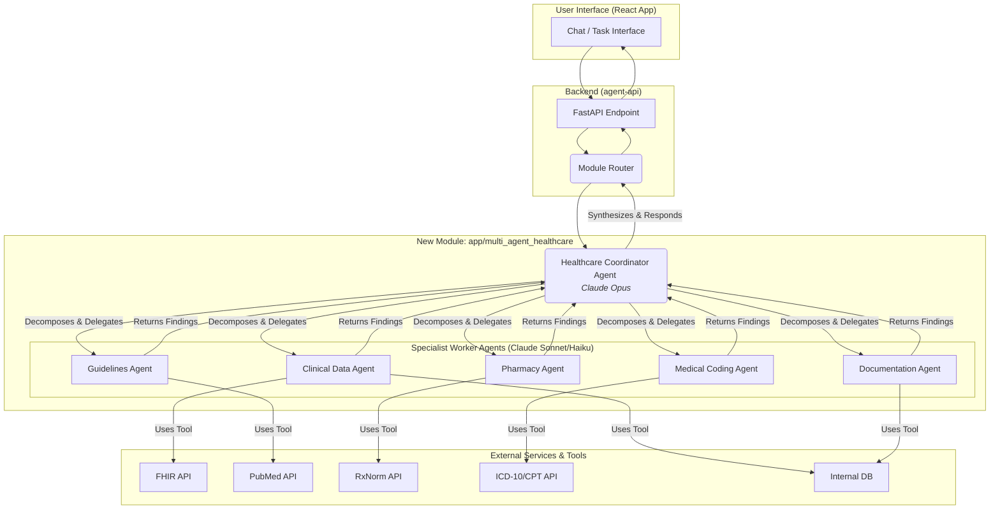

# Multi-Agent Healthcare Coordination Module: Architecture & Integration Strategy

**Author**: Manus AI
**Date**: January 28, 2026

## 1. Executive Summary

This document outlines the architecture and integration strategy for a new **Multi-Agent Healthcare Coordination Module** within the `swiss-ai-vault` platform. The proposed design introduces an enterprise-grade, multi-agent system that operates independently of the existing `app/healthcare` module, ensuring no disruption to current production workflows. This new module will leverage the Anthropic Claude API, specifically employing a sophisticated orchestrator-worker pattern as recommended by Anthropic's own engineering best practices [1].

The architecture is centered around a **Healthcare Coordinator Agent** (the orchestrator) that intelligently decomposes complex healthcare tasks and delegates them to a team of specialized **Worker Agents**. This approach enables parallel processing, deep specialization, and a robust consensus mechanism, leading to more accurate, efficient, and reliable outcomes for complex clinical and administrative workflows.

## 2. Analysis of Existing Architecture

Our analysis of the `swiss-ai-vault` repository reveals a robust and well-structured platform. Key components relevant to this integration include:

- **Frontend**: A Vite/React application providing the user interface.
- **Backend (`agent-api`)**: A Python/FastAPI service that houses the core agentic logic.
- **Agent Supervisor (`app/agent/supervisor.py`)**: A central orchestrator that manages the agent execution loop.
- **LLM Provider (`app/llm/provider.py`)**: A multi-provider system with a primary focus on Anthropic models.
- **Existing Healthcare Module (`app/healthcare`)**: A functional but simpler, single-agent system with predefined tools and workflows.

While the current `HealthcareOrchestrator` is effective for single-turn, tool-using tasks, it does not support the dynamic, multi-agent coordination required for complex, long-running healthcare processes. The new module is designed to address this gap.

## 3. Proposed Multi-Agent Architecture

The new module will be physically located in `agent-api/app/multi_agent_healthcare/` to maintain clear separation from the existing `app/healthcare` module. It will implement the **Orchestrator-Worker** pattern, a proven strategy for building effective agentic systems [2].

### 3.1. Architectural Diagram

### 3.2. Core Components

#### 3.2.1. Healthcare Coordinator Agent (Orchestrator)

- **Model**: Claude Opus (for superior reasoning and planning).
- **Responsibilities**:
    1.  **Task Decomposition**: Receives a high-level healthcare task (e.g., "Prepare a prior authorization request for a patient needing a knee MRI") and breaks it down into logical sub-tasks.
    2.  **Agent Delegation**: Identifies and assigns the appropriate specialist worker agent for each sub-task.
    3.  **State Management**: Maintains the overall state of the task, collecting results from worker agents.
    4.  **Synthesis & Consensus**: Synthesizes the findings from all workers into a coherent final response. For critical decisions, it can implement a **voting mechanism**, querying multiple agents on the same sub-task to reach a consensus.
    5.  **Human-in-the-Loop**: Determines when to request clarification or approval from a human user at critical checkpoints.

#### 3.2.2. Specialist Worker Agents

These agents are single-purpose, highly specialized, and optimized for their specific domain. They will be implemented to use more cost-effective models like Claude Sonnet or Haiku.

| Agent Role                | Responsibilities                                                                                             | Key Tools                                 |
| ------------------------- | ------------------------------------------------------------------------------------------------------------ | ----------------------------------------- |
| **Clinical Data Agent**   | Fetches, reviews, and summarizes patient clinical data from EHRs or internal databases.                        | FHIR API Client, Database Connector       |
| **Medical Coding Agent**  | Looks up, validates, and suggests appropriate ICD-10, CPT, and HCPCS codes based on clinical documentation. | ICD-10/CPT API, Internal Coding Guidelines |
| **Pharmacy Agent**        | Checks for drug-drug interactions, reviews formulary status, and analyzes prescription history.               | RxNorm API, Formulary Database            |
| **Guidelines Agent**      | Conducts literature searches to find supporting clinical guidelines, studies, and payer policies.              | PubMed API, Payer Policy Search Tool      |
| **Documentation Agent**   | Drafts clinical notes, appeal letters, or prior authorization forms based on synthesized information.        | Document Templating Engine, Text Editor   |

## 4. Integration Strategy

The integration is designed to be non-disruptive, introducing the new functionality as a distinct, parallel workflow.

1.  **Directory Structure**: A new directory `agent-api/app/multi_agent_healthcare` will be created to house all components of the new module, including the coordinator, worker agents, prompts, and specific tools.

2.  **API Endpoint**: A new FastAPI endpoint (e.g., `/api/v2/healthcare/tasks`) will be created to serve as the entry point for the multi-agent system. This keeps it separate from the existing V1 endpoints.

3.  **Module Router**: A simple routing mechanism will be implemented at the API layer. Based on the request payload (e.g., a `workflow_type: 'multi_agent'` flag), the router will direct the request to either the existing `HealthcareOrchestrator` or the new `HealthcareCoordinatorAgent`.

4.  **LLM Provider**: The existing `LLMProvider` in `app/llm/provider.py` will be utilized. The new module will be configured to specifically request the appropriate Anthropic models (Opus for the coordinator, Sonnet/Haiku for workers) via this provider.

5.  **Configuration**: All new configurations, including model names, system prompts, and tool definitions, will be managed within the `app/multi_agent_healthcare` directory to avoid conflicts with global or other module-specific settings.

6.  **Deployment**: The new module is part of the existing `agent-api` service. The current Kubernetes deployment configurations for the `agent-api` will not require significant changes, as the new code will be deployed as part of the same container.

## 5. References

[1] Anthropic. (2025, June 13). *How we built our multi-agent research system*. [https://www.anthropic.com/engineering/multi-agent-research-system](https://www.anthropic.com/engineering/multi-agent-research-system)

[2] Anthropic. (2024, December 19). *Building Effective AI Agents*. [https://www.anthropic.com/engineering/building-effective-agents](https://www.anthropic.com/engineering/building-effective-agents)
