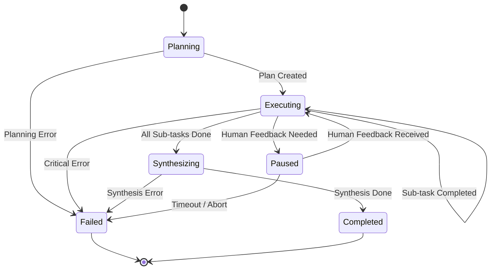

# Multi-Agent Healthcare Module: Technical Requirements & Specifications

**Author**: Manus AI
**Date**: January 28, 2026

## 1. Introduction

This document provides the detailed technical requirements, data schemas, and operational specifications for the **Multi-Agent Healthcare Coordination Module**. It is intended for the senior engineering team and assumes a deep understanding of agentic systems, FastAPI, and the existing `swiss-ai-vault` architecture. This document adheres to the principles of exact implementation terms, as conceptual answers are not sufficient for this level of technical handoff.

## 2. Functional Requirements

- **FR-1**: The system MUST expose a new, versioned API endpoint (`/api/v2/healthcare/tasks`) to initiate multi-agent healthcare tasks.
- **FR-2**: The **Healthcare Coordinator Agent** MUST be able to dynamically decompose a high-level task into a series of sub-tasks for specialist worker agents.
- **FR-3**: The system MUST support a minimum of five distinct specialist worker agent roles as defined in the architecture document.
- **FR-4**: Each worker agent MUST have access to a specific, predefined set of tools relevant to its role.
- **FR-5**: The Coordinator Agent MUST be ableto synthesize the results from all worker agents into a single, coherent final output.
- **FR-6**: The system MUST support a human-in-the-loop capability, allowing the Coordinator Agent to pause execution and request user input at critical decision points.
- **FR-7**: The system MUST maintain a complete, auditable log of all agent actions, tool calls, and decisions for each task.

## 3. Non-Functional Requirements

- **NFR-1 (Security)**: All data containing Protected Health Information (PHI) MUST be encrypted in transit (TLS 1.2+) and at rest (AES-256). The Anthropic API key and other secrets MUST be managed via a secure vault and not be exposed in code or logs.
- **NFR-2 (Reliability)**: The system MUST be designed for high availability with a target uptime of 99.9%. It must include robust error handling and automatic retry mechanisms for transient tool failures.
- **NFR-3 (Performance)**: The median response time for a multi-agent task involving up to 5 worker agents and 10 tool calls should not exceed 120 seconds.
- **NFR-4 (Scalability)**: The system MUST be able to handle a minimum of 100 concurrent multi-agent tasks without significant performance degradation.
- **NFR-5 (Modularity)**: The new module MUST be implemented in `agent-api/app/multi_agent_healthcare` and be fully independent of the existing `app/healthcare` module.

## 4. Data Schemas (Pydantic Models)

These schemas define the data structures for API requests/responses and internal state management.

```python
from pydantic import BaseModel, Field
from typing import List, Dict, Any, Literal

class SubTask(BaseModel):
    sub_task_id: str
    agent_role: str
    instructions: str
    status: Literal["pending", "in_progress", "completed", "failed"] = "pending"
    result: Dict[str, Any] | None = None

class MultiAgentTaskState(BaseModel):
    task_id: str
    original_prompt: str
    overall_status: Literal["planning", "executing", "synthesizing", "paused", "completed", "failed"] = "planning"
    plan: str | None = None
    sub_tasks: List[SubTask] = []
    synthesized_result: Dict[str, Any] | None = None
    human_feedback_request: str | None = None

class TaskCreationRequest(BaseModel):
    prompt: str
    workflow_type: Literal["multi_agent"] = "multi_agent"

class TaskCreationResponse(BaseModel):
    task_id: str
    status: str

class TaskStatusResponse(BaseModel):
    task_id: str
    status: str
    result: Dict[str, Any] | None = None
```

## 5. API Specification (OpenAPI 3.0)

```yaml
openapi: 3.0.0
info:
  title: Swiss AI Vault - Multi-Agent Healthcare API
  version: 2.0.0
paths:
  /api/v2/healthcare/tasks:
    post:
      summary: Create a new multi-agent healthcare task
      requestBody:
        required: true
        content:
          application/json:
            schema:
              $ref: "#/components/schemas/TaskCreationRequest"
      responses:
        "202":
          description: Task accepted for processing
          content:
            application/json:
              schema:
                $ref: "#/components/schemas/TaskCreationResponse"
  /api/v2/healthcare/tasks/{task_id}:
    get:
      summary: Get the status and result of a task
      parameters:
        - name: task_id
          in: path
          required: true
          schema:
            type: string
      responses:
        "200":
          description: Task status and result
          content:
            application/json:
              schema:
                $ref: "#/components/schemas/TaskStatusResponse"
components:
  schemas:
    # ... Pydantic models from section 4 defined here ...
```

## 6. Agent & Tool Specifications

Each worker agent will be defined with a specific system prompt and a curated list of tools. Tool definitions MUST be explicit and follow Anthropic's JSON schema format for tool use.

**Example Tool Definition for `MedicalCodingAgent`**:

```json
{
  "name": "lookup_icd10_code",
  "description": "Looks up ICD-10-CM diagnosis codes based on a clinical keyword or description. Returns a list of matching codes, descriptions, and relevance scores.",
  "input_schema": {
    "type": "object",
    "properties": {
      "query": {
        "type": "string",
        "description": "The clinical term or diagnosis to search for, e.g., \"Type 2 diabetes mellitus without complications\""
      }
    },
    "required": ["query"]
  }
}
```

## 7. Coordinator Control Loop & State Machine

### 7.1. Control Loop Invariants

- **CLI-1**: A task can only exist in one `overall_status` at any given time.
- **CLI-2**: All sub-tasks must be in a `completed` state before the `overall_status` can transition to `synthesizing`.
- **CLI-3**: The `synthesized_result` can only be populated after the `synthesizing` state is complete.
- **CLI-4**: A request for human feedback (`human_feedback_request` is not null) MUST transition the `overall_status` to `paused`.

### 7.2. State Machine



- **State Transitions**: Transitions are strictly enforced. Skipping states is not permitted. Replays are only allowed from a `Paused` state after receiving user feedback.

## 8. Failure Modes & Error Handling

- **Partial Failures**: If a single sub-task fails, the Coordinator will retry it up to 2 times. If it still fails, the Coordinator will assess if it can proceed without the result or if it needs to escalate.
- **Propagation**: A sub-task failure will not immediately cause a task-level failure. The Coordinator makes the final decision.
- **Idempotency**: The `/api/v2/healthcare/tasks` endpoint is NOT idempotent. Multiple POST requests with the same payload will create multiple distinct tasks.
- **Orchestrator Conditions**:
    - **Retry**: On transient tool errors (e.g., API timeout).
    - **Escalate**: When a sub-task repeatedly fails and the information is critical.
    - **Abort**: If the initial planning phase fails or if a critical number of sub-tasks fail.
    - **Re-plan**: Not supported in the initial version. The initial plan is considered immutable for a given task.
