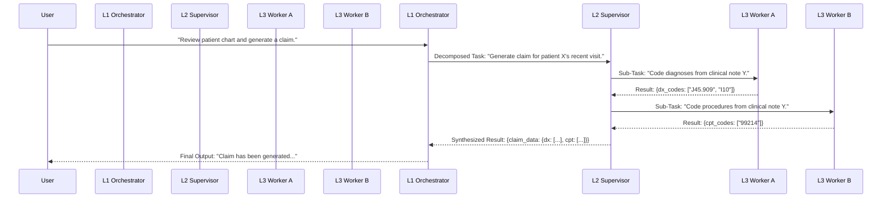

# Multi-Agent Interaction & Consensus Mechanisms

**Author**: Manus AI
**Date**: January 28, 2026

## 1. Core Interaction Pattern: Hierarchical Teams

The entire 100+ agent system is built upon a **Hierarchical Agent Teams** architecture, implemented using LangChain's LangGraph library. This pattern provides a structured and scalable way for agents to communicate and collaborate.

The interaction flows vertically through the three levels of the agent taxonomy:

1.  **Top-Down Delegation**: A task flows from the `Global_Orchestrator` down to a `Team_Supervisor`, which then delegates sub-tasks to one or more `Worker_Agents`.
2.  **Bottom-Up Reporting**: `Worker_Agents` complete their task and report their findings back to their `Team_Supervisor`. The `Team_Supervisor` then synthesizes the results from its workers and reports the consolidated findings up to the `Global_Orchestrator`.

This creates a clear chain of command and ensures that information is processed and refined at each level.

### Communication Workflow Diagram



## 2. Communication Protocol

All communication between agents is managed through the **state object** within the LangGraph `StateGraph`. This state object acts as a shared memory or message bus for the duration of a task. A standardized message format is used to ensure clarity and consistency.

### LangGraph State Definition

The state is a `TypedDict` that includes the history of messages, the next agent to act, and the accumulated data.

```python
from typing import List, TypedDict, Annotated
from langgraph.graph.message import add_messages

class AgentState(TypedDict):
    # The history of messages in the conversation
    messages: Annotated[list, add_messages]
    # The next agent to act
    next: str
    # A dictionary to store the outputs from different agents
    task_outputs: dict
```

When a worker agent completes its task, it doesn't communicate directly with another worker. Instead, it adds its result to the `task_outputs` dictionary in the state and passes control back to its supervisor. The supervisor can then inspect the state to decide the next action.

## 3. Consensus Mechanisms

Consensus is not a single, global process but is applied strategically at different levels of the hierarchy to ensure accuracy and resolve ambiguity.

### 3.1. Level 3 (Worker Level): No Consensus Needed

Individual worker agents are designed to be deterministic and specialized. They execute a specific task with a specific tool (e.g., `FHIR_Patient_Reader` fetches a patient record). As they are not making subjective judgments, a consensus mechanism is not required at this level.

### 3.2. Level 2 (Supervisor Level): Voting-Based Council

For critical, subjective tasks such as medical coding or data interpretation, the `Team_Supervisor` can act as a coordinator for a **Voting-Based Council**. This pattern, inspired by democratic AI principles [1], improves accuracy by polling multiple specialized agents.

**Example Workflow: `Revenue_Cycle_Supervisor` for Complex Coding**

1.  **Dispatch**: The supervisor receives a complex clinical note to be coded.
2.  **Parallel Execution**: It dispatches the same note to three different, slightly varied `ICD10_CM_Coder` agents in parallel. These agents might have different system prompts (e.g., one conservative, one aggressive, one balanced) or use slightly different models.
3.  **Vote**: Each agent returns its list of proposed codes.
4.  **Aggregate**: The supervisor tallies the votes. A code that is proposed by at least 2 out of the 3 agents is accepted.
5.  **Decision**: The consensus-based list of codes is used for the final claim.

This approach mitigates the risk of a single agent's error or bias and is a powerful pattern for ensuring high-stakes accuracy.

### 3.3. Level 1 (Orchestrator Level): Synthesis and Reconciliation

The `Global_Orchestrator`'s primary role is to **synthesize** the structured outputs from different teams into a coherent final answer. However, it also performs a crucial **reconciliation** function when it detects conflicts between the outputs of different teams.

**Example Workflow: Conflicting Information**

1.  **Detection**: The `Global_Orchestrator` receives a report from the `Clinical_Ops_Supervisor` stating a patient received an MRI. It also receives a report from the `Revenue_Cycle_Supervisor` stating no claim was filed for an MRI.
2.  **Conflict Identification**: The orchestrator identifies this as a conflict.
3.  **Reconciliation Task**: Instead of guessing, it creates a new, high-priority task: "Reconcile discrepancy in MRI record for Patient X. Clinical team reports it was performed, but billing team has no record. Investigate and confirm status."
4.  **Re-delegation**: This new task is routed back down to the relevant supervisors (`Clinical_Ops` and `Revenue_Cycle`) to investigate and resolve the discrepancy.

This feedback loop ensures the system is robust and can self-correct when inconsistencies arise.

## 4. References

[1] Schepis, E. (2025). *Patterns for Democratic Multi‑Agent AI: Voting-Based Council*. Medium. [https://medium.com/@edoardo.schepis/patterns-for-democratic-multi-agent-ai-voting-based-council-part-2-implementation-2992c3e7c2be](https://medium.com/@edoardo.schepis/patterns-for-democratic-multi-agent-ai-voting-based-council-part-2-implementation-2992c3e7c2be)
